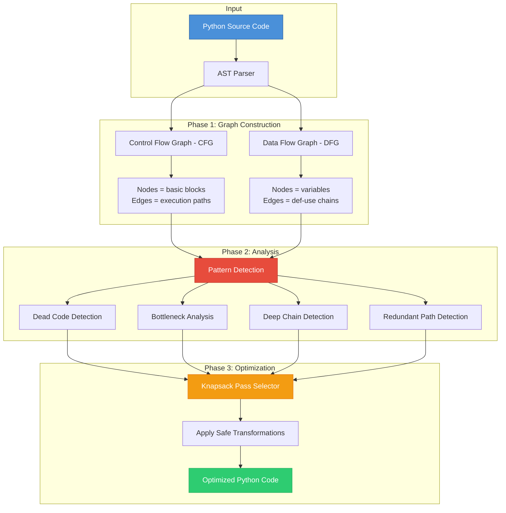
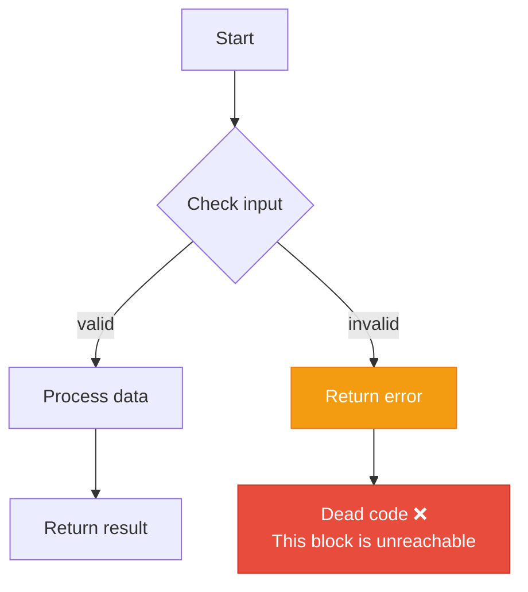
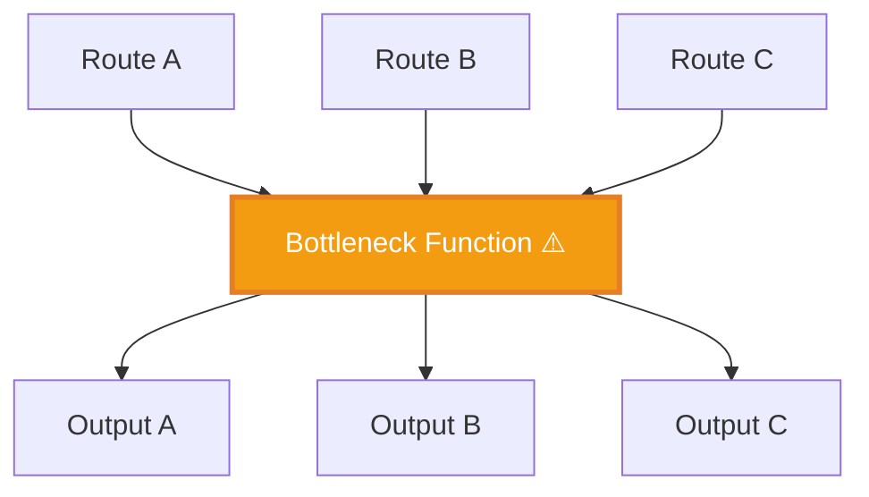
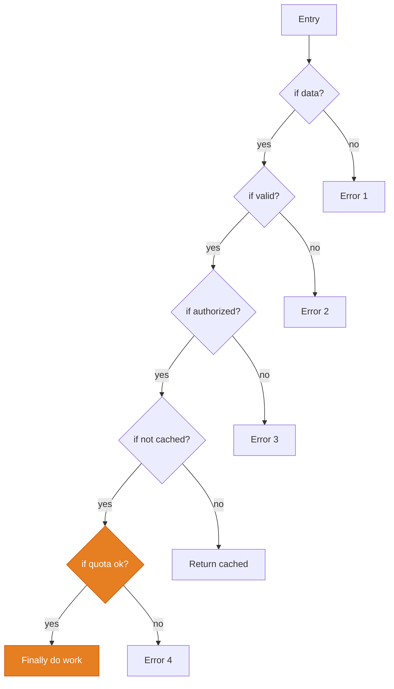
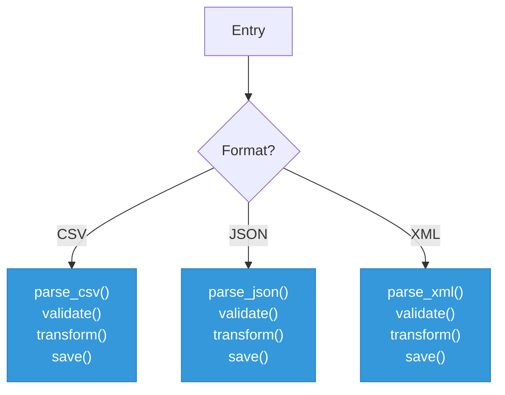
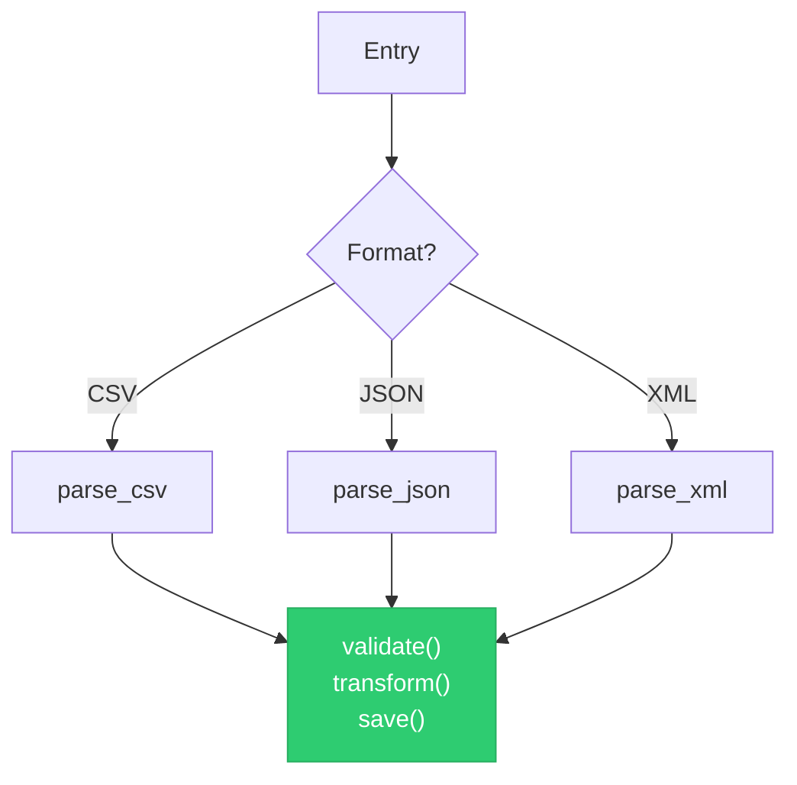
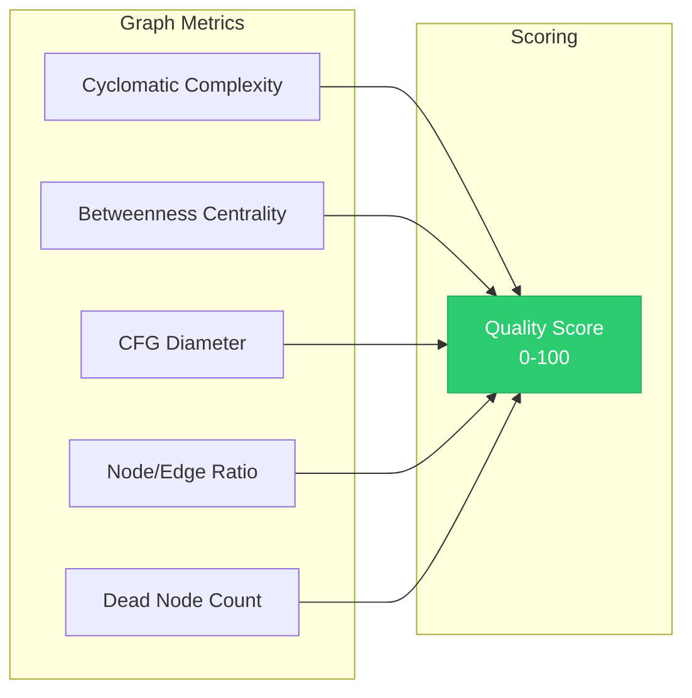
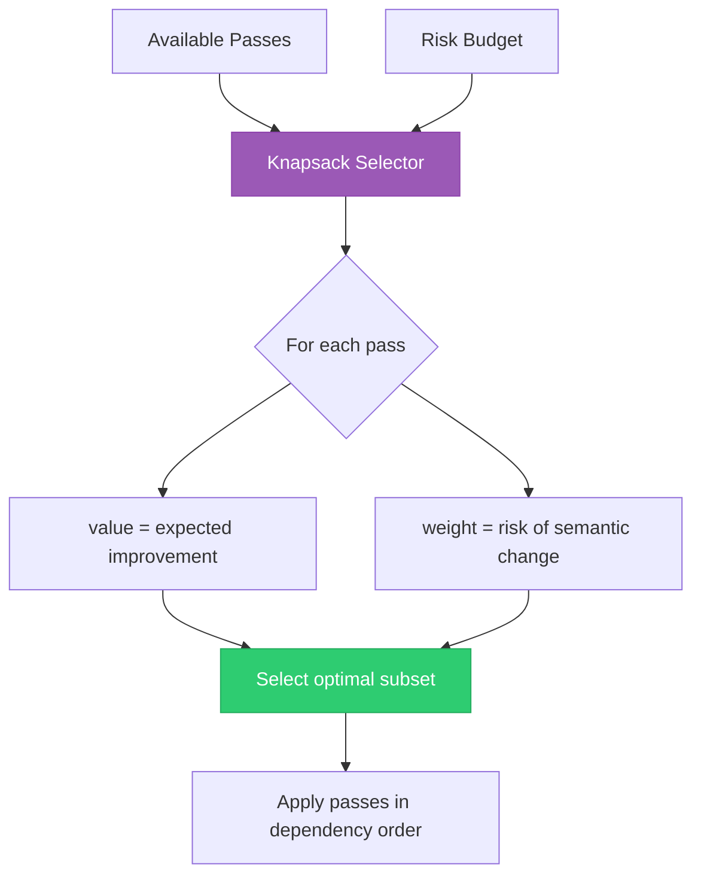
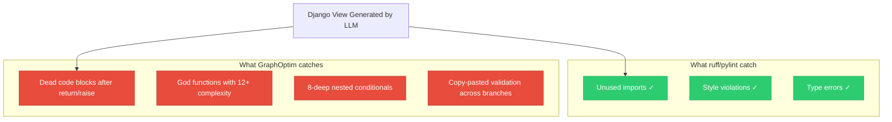
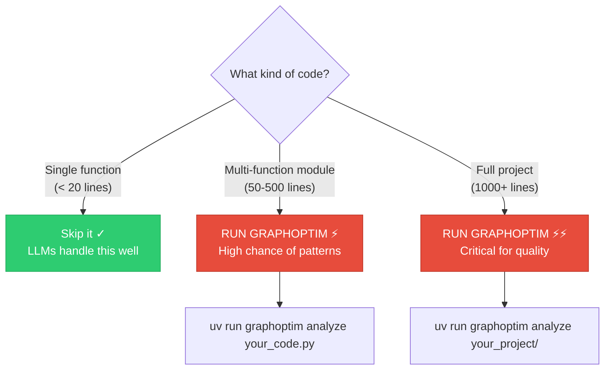

# How GraphOptim Makes LLM-Generated Code Better

## The Problem

Large Language Models (LLMs) generate code that **works** — it passes tests, handles edge cases, and follows conventions. But working code is not the same as **structurally efficient** code.

When an LLM generates a 200+ line module, it doesn't "see" the overall control flow graph. It generates code **sequentially**, token by token, which introduces patterns that a human reviewing the full architecture would catch — but that traditional linters like `ruff` or `pylint` cannot detect.

> **GraphOptim operates at a layer above syntax — it analyzes the _structure_ of your code as a graph, finding inefficiencies invisible to rule-based tools.**

---

## Architecture Overview



---

## The Four Structural Patterns

GraphOptim detects four categories of structural inefficiency that LLMs consistently produce in complex code:

### 1. 🔴 Dead Code (Unreachable Nodes)

**What it is:** Code blocks that can never be executed — they exist in the source but no execution path reaches them.

**Why LLMs produce it:** LLMs generate code sequentially. When handling error recovery or early returns, they often continue generating code **after** a guaranteed return/raise, creating unreachable blocks.



**Example — LLM-generated code:**
```python
def process_data(data):
    if not data:
        raise ValueError("No data provided")
        logger.error("Failed to process")  # ← DEAD CODE: never reached
        return None                         # ← DEAD CODE: never reached

    result = transform(data)
    return result
```

**After GraphOptim:**
```diff
 def process_data(data):
     if not data:
         raise ValueError("No data provided")
-        logger.error("Failed to process")
-        return None
 
     result = transform(data)
     return result
```

**How it's detected:** GraphOptim builds a CFG and runs reachability analysis from the entry node. Any node not reachable from the entry is dead code.

---

### 2. 🟡 Bottleneck Nodes (High Betweenness Centrality)

**What it is:** A single function or code block through which too many execution paths flow — a structural single point of failure.

**Why LLMs produce it:** LLMs tend to create "god functions" that handle validation, transformation, error handling, and logging all in one place, making that function a critical bottleneck.



**Example — LLM-generated code:**
```python
def handle_request(request):
    """Every single request flows through here."""
    validate(request)         # validation
    authenticate(request)     # auth
    rate_limit(request)       # throttling
    log_request(request)      # logging
    result = process(request) # business logic
    cache_result(result)      # caching
    log_response(result)      # more logging
    return result
```

**Recommendation:** GraphOptim flags this and suggests splitting into middleware/pipeline:


**How it's detected:** GraphOptim computes **betweenness centrality** for each node in the CFG. Nodes with centrality > threshold (default 0.7) are flagged as bottlenecks.

> **Betweenness Centrality** = fraction of all shortest paths in the graph that pass through a given node. High values mean the node is a critical chokepoint.

---

### 3. 🟠 Deep Chains (Excessive Nesting Depth)

**What it is:** Deeply nested conditional/loop chains that create long, linear execution paths through the CFG.

**Why LLMs produce it:** LLMs handle edge cases by adding `if` checks inside existing blocks rather than restructuring — leading to 4-5+ levels of nesting.



**Example — LLM-generated code:**
```python
def process_file(path):
    if path:
        if os.path.exists(path):
            if path.endswith('.csv'):
                with open(path) as f:
                    data = csv.reader(f)
                    if data:
                        for row in data:
                            if len(row) > 3:
                                yield transform(row)  # depth = 8!
```

**After GraphOptim (guard clause refactoring):**
```diff
 def process_file(path):
-    if path:
-        if os.path.exists(path):
-            if path.endswith('.csv'):
-                with open(path) as f:
-                    ...
+    if not path:
+        return
+    if not os.path.exists(path):
+        return
+    if not path.endswith('.csv'):
+        return
+
+    with open(path) as f:
+        data = csv.reader(f)
+        for row in data:
+            if len(row) > 3:
+                yield transform(row)  # depth = 3 ✓
```

**How it's detected:** GraphOptim measures the **diameter** of the CFG (longest shortest path between any two nodes). Functions exceeding the threshold (default 8) are flagged.

---

### 4. 🔵 Redundant Paths (Duplicate Conditional Branches)

**What it is:** Multiple execution paths that perform equivalent operations — the same logic is reachable through different branches but produces identical results.

**Why LLMs produce it:** When generating complex conditional logic, LLMs often duplicate handling code across branches instead of extracting shared logic.



Note how `validate() → transform() → save()` is repeated in every branch.

**After optimization:**


**How it's detected:** GraphOptim identifies subgraphs (sequences of nodes) that are structurally isomorphic across different branches of the CFG.

---

## The Optimization Pipeline

### Step 1: Build the Graph

For each function in the source code, GraphOptim constructs:

| Graph | Nodes | Edges | Purpose |
|-------|-------|-------|---------|
| **CFG** (Control Flow Graph) | Basic blocks | Jump/branch connections | Detect control flow patterns |
| **DFG** (Data Flow Graph) | Variable definitions | Def-use chains | Track data dependencies |

### Step 2: Compute Metrics



| Metric | What it measures | Ideal value |
|--------|-----------------|-------------|
| **Cyclomatic Complexity** | Number of independent paths through the code | ≤ 7 |
| **Betweenness Centrality** | How much a node acts as a chokepoint | < 0.7 |
| **CFG Diameter** | Longest shortest path (nesting depth proxy) | ≤ 8 |
| **Dead Node Count** | Unreachable basic blocks | 0 |
| **Node/Edge Ratio** | Graph density (complexity indicator) | ~0.5 |

### Step 3: Select Optimization Passes

GraphOptim uses a **0/1 Knapsack algorithm** to select the best set of optimization passes given a risk budget:



| Pass | What it does | Risk | Value |
|------|-------------|------|-------|
| `dead_code` | Removes unreachable blocks | Low | High (clean code) |
| `path_shortener` | Flattens deep nesting with guard clauses | Medium | High (readability) |
| `centrality` | Suggests splitting bottleneck functions | Advisory only | Medium (architecture) |

### Step 4: Apply & Verify

Every transformation:
1. ✅ Is applied to the AST (not text-based)
2. ✅ Preserves all comments and docstrings
3. ✅ Creates a `.bak` backup by default
4. ✅ Runs in **dry-run mode** unless explicitly opted out

---

## Real-World Benchmark Results

We tested GraphOptim on complex, multi-function code generated by **Claude Opus 4.6** and **GPT-4.1**:

### Claude Opus 4.6 (4 tasks)

| Task | Description | Functions | LOC | Score | Patterns | Deep Chains | Redundant |
|------|------------|:---------:|:---:|:-----:|:--------:|:-----------:|:---------:|
| RW/001 | Data Parser | 21 | 825 | **36** | **2,207** | 145 | 2,062 |
| RW/002 | Auth System | 0* | 867 | 100 | 0 | 0 | 0 |
| RW/003 | Caching | 3 | 990 | 94 | 1 | 1 | 0 |
| RW/004 | Log Analyzer | 16 | 785 | **67→72** | **187** | 53 | 134 |

### GPT-4.1 (10 tasks)

| Task | Description | Functions | LOC | Score | Patterns | Deep Chains | Redundant |
|------|------------|:---------:|:---:|:-----:|:--------:|:-----------:|:---------:|
| RW/001 | Data Parser | 10 | 216 | **52** | **333** | 49 | 284 |
| RW/002 | Auth System | 28 | 376 | 94 | 13 | 2 | 11 |
| RW/003 | Caching | 2 | 237 | **50** | 16 | 2 | 14 |
| RW/004 | Log Analyzer | 15 | 385 | **62→72** | **191** | 31 | 160 |
| RW/009 | Text Processing | 21 | 309 | 90 | **95** | 11 | 84 |

*\*0 functions = all code in class methods, not standalone functions*

Compare this to **HumanEval** (single-function, 6-line problems):

| Dataset | Avg LOC | Avg Functions | Patterns Found | GraphOptim Score |
|---------|:-------:|:-------------:|:--------------:|:----------------:|
| HumanEval | 6 | 1 | **0** | 100/100 |
| Real-World | 400+ | 10+ | **100-2,200** | 36-67/100 |

> **Conclusion:** LLMs produce clean code for simple tasks but introduce significant structural inefficiencies in complex, multi-function modules — exactly the kind of code used in production.

---

## Practical Example: Django Web App

Here's exactly how a developer using GraphOptim would benefit, step by step.

### Scenario

You asked an LLM (Copilot, Cursor, ChatGPT) to build a Django REST API with user management:

```
"Build a Django REST API with user registration, login, 
profile management, password reset, and admin dashboard."
```

The LLM generates `views.py`, `serializers.py`, `models.py`, `utils.py` — 500+ lines.

### Step 1: Analyze a Single File

```bash
uv run graphoptim analyze myapp/views.py
```

```
GraphOptim Analysis — myapp/views.py
  Functions analyzed: 12
  Total optimization score: 64/100 ⚠

register_user()      score: 45/100  ⚠ needs attention
  Cyclomatic complexity: 12   (threshold: 7)
  Deep chain: depth 9 (lines 15-48)
  Suggested passes: dead_code, path_shortener

login_user()         score: 52/100  ⚠ needs attention
  Dead nodes: 2 (unreachable at lines 72, 78)
  Suggested passes: dead_code

process_payment()    score: 38/100  ⚠ needs attention
  Betweenness bottleneck: 0.85 (line 120 is critical path)
  Deep chain: depth 11 (lines 110-155)
  Suggested passes: path_shortener, centrality
```

### Step 2: Analyze the Entire Project

```bash
uv run graphoptim analyze myproject/
```

```
GraphOptim Analysis — myproject/
  Files analyzed: 8
  Functions analyzed: 47
  Average score: 72/100

Run graphoptim optimize myproject/ to apply fixes.
```

### Step 3: Preview Optimization (Dry-Run)

```bash
uv run graphoptim optimize myapp/views.py
```

This shows the optimized code **without touching the file** — safe to run anytime.

### Step 4: Apply Optimization

```bash
# Apply changes (creates views.py.bak backup)
uv run graphoptim optimize myapp/views.py --inplace

# Or write to a new file
uv run graphoptim optimize myapp/views.py -o myapp/views_optimized.py
```

### Step 5: Verify the Improvement

```bash
uv run graphoptim analyze myapp/views.py
```

```
GraphOptim Analysis — myapp/views.py
  Functions analyzed: 12
  Total optimization score: 87/100 ✓    ← was 64

register_user()      score: 78/100 ~ acceptable  ← was 45
login_user()         score: 92/100 ✓ good         ← was 52
process_payment()    score: 71/100 ~ acceptable   ← was 38
```

### Step 6: Add to CI/CD Pipeline

```yaml
# .github/workflows/graphoptim.yml
name: Code Quality
on: [pull_request]
jobs:
  structural-analysis:
    runs-on: ubuntu-latest
    steps:
      - uses: actions/checkout@v4
      - uses: astral-sh/setup-uv@v5
      - run: uv pip install graphoptim
      - name: GraphOptim Analysis
        run: |
          uv run graphoptim analyze . --format json -o report.json
          # Fail if average score < 70
          SCORE=$(python -c "import json; d=json.load(open('report.json')); print(round(sum(r['total_score'] for r in d)/len(d)))")
          echo "Average score: $SCORE"
          if [ "$SCORE" -lt 70 ]; then
            echo "::error::GraphOptim score $SCORE is below threshold 70"
            exit 1
          fi
```

### What This Catches (That Linters Miss)



---

## When To Use GraphOptim



### Use Cases

| Scenario | Benefit |
|----------|---------|
| **CI/CD Pipeline** | Automated quality gate for LLM-generated PRs |
| **Code Review** | Quantified structural analysis (not just style) |
| **Agentic Coding** | Clean up after Copilot/Cursor iterations |
| **Legacy Refactoring** | Find structural debt in existing codebases |
| **Education** | Teach developers _why_ code is inefficient, with graph theory |

---

## Comparison With Existing Tools

| Tool | Syntax Errors | Style | Dead Code | Bottlenecks | Deep Chains | Redundant Paths | Graph Analysis |
|------|:---:|:---:|:---:|:---:|:---:|:---:|:---:|
| **ruff** | ✓ | ✓ | partial | ✗ | ✗ | ✗ | ✗ |
| **pylint** | ✓ | ✓ | partial | ✗ | ✗ | ✗ | ✗ |
| **mypy** | ✓ | ✗ | ✗ | ✗ | ✗ | ✗ | ✗ |
| **vulture** | ✗ | ✗ | ✓ | ✗ | ✗ | ✗ | ✗ |
| **GraphOptim** | ✗ | ✗ | **✓** | **✓** | **✓** | **✓** | **✓** |

> GraphOptim is **complementary** to linters — it catches a different class of problems that operate at the structural level, not the syntactic level.

---

*Generated for GraphOptim v0.1.0 — Graph-Theoretic Optimizer for AI-Generated Python Code*
